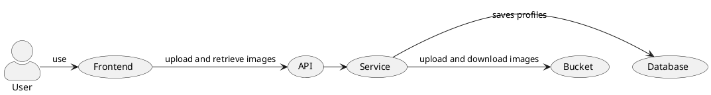

# Getting started

This repository shows how to upload and download images using Spring Boot, AWS and React.
Axios was used for saving the user profiles into the databse.

<!---

```plantuml
@startuml
skinparam actorStyle awesome
:User: as user
user -> (Frontend): use
(Frontend) -> (API): upload and retrieve images
(API) -> (Service)
(Service) -> (Database): saves profiles
(Service) -> (Bucket): upload and download images
@enduml
```
-->

